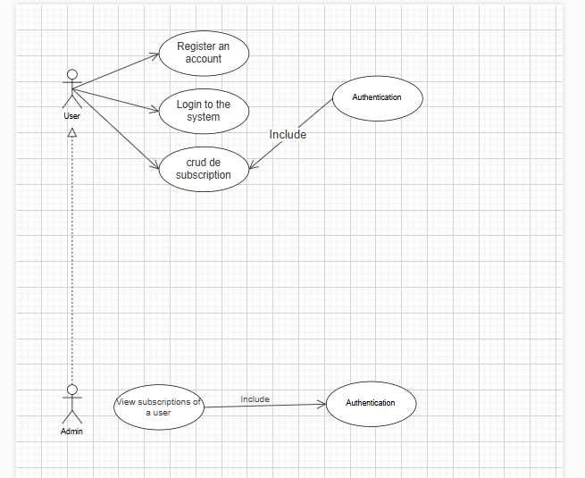
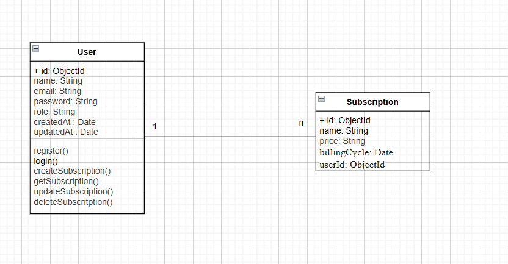

# 📒 API SubLedger

A RESTful API for managing user subscriptions, built with **Node.js**, **Express**, and **MongoDB**. Features JWT authentication, role-based access control, and full CRUD operations for subscriptions.

---

## 📐 Diagrams

### Class Diagram



### Use Case Diagram



---

## 🚀 Tech Stack

| Package           | Version | Purpose               |
| ----------------- | ------- | --------------------- |
| express           | ^5.2.1  | Web framework         |
| mongoose          | ^9.2.4  | MongoDB ODM           |
| bcrypt            | ^6.0.0  | Password hashing      |
| jsonwebtoken      | ^9.0.3  | JWT authentication    |
| express-validator | ^7.3.1  | Request validation    |
| dotenv            | ^17.3.1 | Environment variables |
| nodemon           | ^3.1.14 | Dev auto-restart      |

---

## 📁 Project Structure

```
API_SubLedger/
├── controllers/
│   ├── admin.controller.js        # Admin-only operations
│   ├── auth.controller.js         # Sign up & login
│   ├── subscription.controller.js # Subscription CRUD
│   └── user.controller.js         # User operations
│
├── middlewares/
│   ├── authMiddleware.js          # protectRoute & requireAdmin
│   ├── subscription.middleware.js # Subscription validation
│   └── validateMiddleware.js      # Auth validation (signup/login)
│
├── models/
│   ├── Subscription.js            # Subscription schema
│   └── User.js                    # User schema
│
├── routes/
│   ├── admin.route.js             # Admin routes
│   ├── auth.route.js              # Auth routes
│   ├── subscription.route.js      # Subscription routes
│   └── user.route.js              # User routes
│
├── .gitignore
├── package.json
├── readme.md
└── server.js
```

---

## ⚙️ Getting Started

### 1. Clone the repository

```bash
git clone https://github.com/your-username/api-subledger.git
cd api-subledger
```

### 2. Install dependencies

```bash
npm install
```

### 3. Create a `.env` file in the root directory

```env
PORT=5000
MONGO_URI=mongodb://localhost:27017/subledger
JWT_SECRET=your_jwt_secret_here
JWT_EXPIRES_IN=7d
NODE_ENV=development
```

### 4. Generate a secure JWT secret

```bash
node -e "console.log(require('crypto').randomBytes(64).toString('hex'))"
```

### 5. Run the server

```bash
# Development
npm run dev

# Production
node server.js
```

---

## 🔐 Authentication

The API uses **JWT tokens** sent in the `Authorization` header:

```
Authorization: Bearer <your_token_here>
```

### Roles

| Role    | Description                                                     |
| ------- | --------------------------------------------------------------- |
| `user`  | Can manage their own subscriptions                              |
| `admin` | Can view subscriptions of any user — **only one admin allowed** |

---

## 📡 API Endpoints

### Auth

| Method | Endpoint           | Access | Description         |
| ------ | ------------------ | ------ | ------------------- |
| `POST` | `/api/auth/signup` | Public | Register a new user |
| `POST` | `/api/auth/login`  | Public | Login and get token |

#### Sign Up Body

```json
{
  "name": "John Doe",
  "email": "john@gmail.com",
  "password": "Secret123",
  "role": "user"
}
```

#### Login Body

```json
{
  "email": "john@gmail.com",
  "password": "Secret123"
}
```

---

### Subscriptions

| Method   | Endpoint                 | Access | Description                |
| -------- | ------------------------ | ------ | -------------------------- |
| `POST`   | `/api/subscriptions`     | User   | Create a subscription      |
| `GET`    | `/api/subscriptions`     | User   | Get all your subscriptions |
| `GET`    | `/api/subscriptions/:id` | User   | Get a single subscription  |
| `PUT`    | `/api/subscriptions/:id` | User   | Update a subscription      |
| `DELETE` | `/api/subscriptions/:id` | User   | Delete a subscription      |

#### Create / Update Subscription Body

```json
{
  "name": "Netflix",
  "price": 15.99,
  "billingCycle": "2025-04-01"
}
```

---

### Admin

| Method | Endpoint                                 | Access | Description                     |
| ------ | ---------------------------------------- | ------ | ------------------------------- |
| `GET`  | `/api/admin/users/:userId/subscriptions` | Admin  | Get all subscriptions of a user |

---

## 🛡️ Middleware

| Middleware                   | File                         | Description                            |
| ---------------------------- | ---------------------------- | -------------------------------------- |
| `protectRoute`               | `authMiddleware.js`          | Verifies JWT token from header         |
| `requireAdmin`               | `authMiddleware.js`          | Checks if user has admin role          |
| `validateSignUp`             | `validateMiddleware.js`      | Validates signup fields                |
| `validateLogin`              | `validateMiddleware.js`      | Validates login fields                 |
| `validateCreateSubscription` | `subscription.middleware.js` | Validates new subscription fields      |
| `validateUpdateSubscription` | `subscription.middleware.js` | Validates update fields (all optional) |
| `validateSubscriptionId`     | `subscription.middleware.js` | Validates MongoDB ID param             |

---

## 📊 HTTP Status Codes

| Code  | Meaning                                       |
| ----- | --------------------------------------------- |
| `200` | OK                                            |
| `201` | Created                                       |
| `400` | Bad Request — missing or invalid fields       |
| `401` | Unauthorized — no token or invalid token      |
| `403` | Forbidden — valid token but insufficient role |
| `404` | Not Found — resource doesn't exist            |
| `409` | Conflict — email already exists               |
| `500` | Internal Server Error                         |

---

## 🌱 Environment Variables

| Variable         | Description                                 |
| ---------------- | ------------------------------------------- |
| `PORT`           | Port the server runs on                     |
| `MONGO_URI`      | MongoDB connection string                   |
| `JWT_SECRET`     | Secret key for signing JWT tokens           |
| `JWT_EXPIRES_IN` | Token expiry duration (e.g. `7d`)           |
| `NODE_ENV`       | Environment (`development` or `production`) |

---

## 📝 License

ISC
